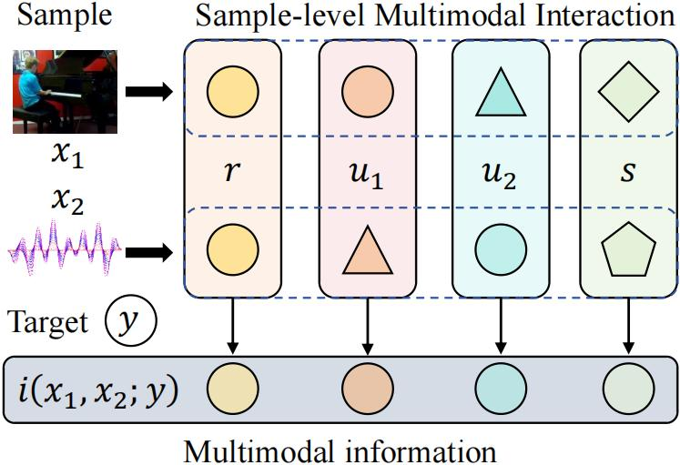
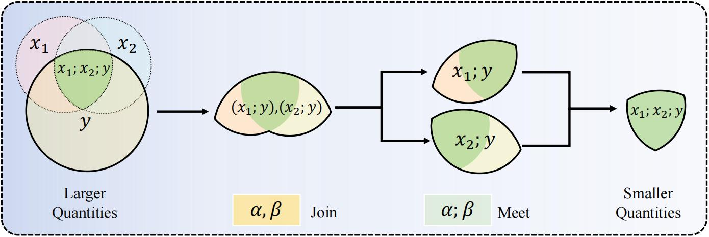

# Official PyTorch implementation of LSMI_Estimator

Here is the official PyTorch implementation of *Lightweight Sample-wise Multimodal Interaction* (LSMI) Estimator proposed in ''*Efficient Quantification of Multimodal Interaction at Sample Level*'', which is efficient multimodal interaction estimator at the sample level distinguishing redundancy, uniqueness and synergy. Please refer to our ICML 2025 paper for more details.

**Paper Title: "Efficient Quantification of Multimodal Interaction at Sample Level"**


**Authors: [Zequn Yang](https://bjlfzs.github.io/), [Hongfa Wang](https://scholar.google.com.hk/citations?hl=zh-CN&user=q9Fn50QAAAAJ), [Di Hu](https://dtaoo.github.io/index.html)**

**Accepted by: Forty-Second International Conference on Machine Learning (ICML 2025)**


## Methodology

<div align="center">
  
</div>
Illustrates multimodal interactions at the sample level, showcasing redundancy $r$, uniqueness $u_1, u_2$, and synergy $s$ that constitute multimodal information $i(x_1, x_2; y)$.

LSMI aims to distinguish task-relevant information generated from two modalities, \(x_1, x_2\), with respect to a target \(y\), into:
*   **Redundancy (\(r\))**: Information shared between \(x_1\) and \(x_2\) about \(y\).
*   **Uniqueness (\(u_1, u_2\))**: Information unique to \(x_1\) (or \(x_2\)) about \(y\).
*   **Synergy (\(s\))**: Information that emerges only when \(x_1\) and \(x_2\) are considered together about \(y\).

These pointwise interactions satisfy:
\[ i(x_1; y) = r + u_1 \]
\[ i(x_2; y) = r + u_2 \]
\[ i(x_1, x_2; y) = r + u_1 + u_2 + s, \]

where \(i(x;y)\) is the pointwise mutual information.

### Redundancy-based Interaction Framework

To uniquely determine these interactions, we focus on defining redundancy (\(r\)) from a pointwise perspective. The redundancy interaction can be obtained by the information decomposition framework as shown in the following figure. 

<div align="center">
  
</div>

Depicts the event-level redundancy information estimation framework. This framework traces information flow through a lattice structure to identify redundant components, ensuring that information quantities monotonically decrease along the decomposition path.
   


1.  **Challenge with Pointwise Mutual Information**: Pointwise mutual information \(i(x; y)\) can be negative, violating monotonicity required for set-theoretic decomposition of redundancy.
2.  **Solution**: We decompose information into two positive components, \(i^+(x; y)\) and \(i^-(x; y)\), which adhere to monotonicity:
    \[ i^+(x; y) = h(x) = -\log p(x) \]
    \[ i^-(x; y) = h(x|y) = -\log p(x|y) \]
and 
    \[ i(x; y) = i^+(x; y) - i^-(x; y) \]
1.  **Pointwise Redundancy**: Redundancies for each component are defined as:
    \[ r^+(x_1; x_2; y) = \min(i^+(x_1; y), i^+(x_2; y)) \]
    \[ r^-(x_1; x_2; y) = \min(i^-(x_1; y), i^-(x_2; y)) \]
    The overall pointwise redundancy is:
    \[ r(x_1; x_2; y) = r^+(x_1; x_2; y) - r^-(x_1; x_2; y) \]
This definition of \(r\) allows for the unique determination of \(u_1, u_2,\) and \(s\).

### Lightweight Interaction Estimation

To quantify interactions for continuous distributions:
1.  **Entropy Estimation**: We use KNIFE (Pichler et al., 2022) for efficient differential entropy estimation, providing \(h_{\theta}(x)\) as an estimate for \(h(x)\) (the \(i^+\) component).
    \[ \mathbb{E} [h_{\theta}(x)] = \mathbb{E} [h(x)] + D_{KL}(p(x)||p_{\theta}(x)) \geq H(X) \]
2.  **Estimating \(i^-\)**: Once unimodal discriminative models \(p(y|x_m)\) are determined, the \(i^-\) component is estimated as:
    \[ i^-(x_m ; y) = h_{\theta_m} (x_m) -h(y) - \log p(y|x_m) \]
This approach avoids modeling a base distribution, making it lightweight and suitable for sample-level estimation.

(Our framework can be naturally extended to handle multiple modalities; see Appendix A of the paper for details.)

### Visual Overview


  


## Get Started
### Requirements 
- Python 3.8
<pre><code>
pip install -r requirements.txt
</code></pre>

### Run
You can simply run the demo of LSMI_Estimator using:  
<pre><code>
python main_lsmi.py
</code></pre>
You can adjust the algorithm's detailed setting by modifying parameters. And alternate datasets can also be utilized.

<!-- ### Data Preparation
*(If LSMI requires specific data preparation, describe it here. Otherwise, you can remove this subsection or state that standard datasets can be used.)*
The original datasets mentioned in the broader context of related research include:
[Kinetics-Sounds](https://github.com/cvdfoundation/kinetics-dataset).
[UCF101](https://www.crcv.ucf.edu/data/UCF101.php),
[VGGSound](https://www.robots.ox.ac.uk/~vgg/data/vggsound/),
Please clarify if these or other specific datasets and preprocessing are needed for LSMI. -->


## Usage

<!-- ```python -->


## Citation

If you find this work useful, please consider citing it.

<pre><code>
@inproceedings{yang2025Efficient,
  title={Efficient Quantification of Multimodal Interaction at Sample Level},
  author={Yang, Zequn and Wang, Hongfa and Hu, Di},
  booktitle={Forty-Second International Conference on Machine Learning},
  year={2025}
}
</code></pre>

## Acknowledgement

This work is sponsored by CCF-Tencent Rhino-Bird Open Research Fund, the National Natural Science Foundation of China (Grant No.62106272), the Public Computing Cloud of Renmin University of China, and the fund for building world-class universities (disciplines) of Renmin University of China.


## Contact us

If you have any detailed questions or suggestions, you can email us:
**zqyang@ruc.edu.cn** 